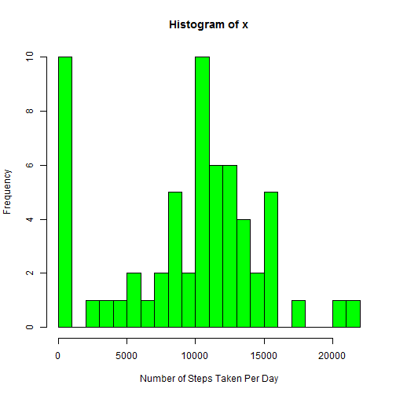
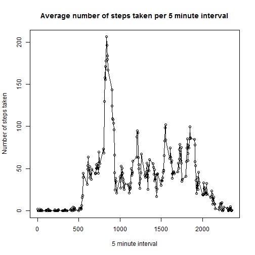
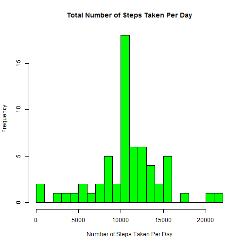
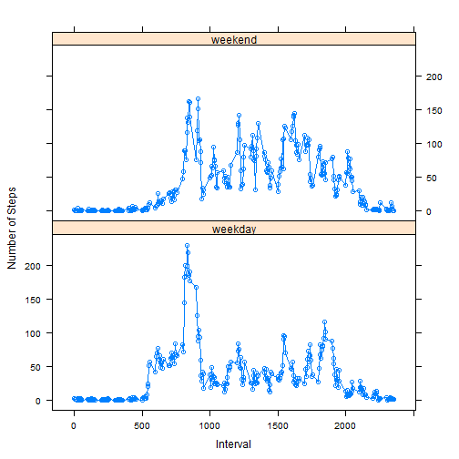

Reproducible Research: Peer Assessment 1
========================

###1. Code for reading in the dataset and/or processing the data


```r
data <- read.csv("activity.csv", header = TRUE, colClasses = c("double","character","double"), na.strings = "NA")

head(data)
```

```
##   steps       date interval
## 1    NA 2012-10-01        0
## 2    NA 2012-10-01        5
## 3    NA 2012-10-01       10
## 4    NA 2012-10-01       15
## 5    NA 2012-10-01       20
## 6    NA 2012-10-01       25
```

```r
summary(data)
```

```
##      steps            date              interval     
##  Min.   :  0.00   Length:17568       Min.   :   0.0  
##  1st Qu.:  0.00   Class :character   1st Qu.: 588.8  
##  Median :  0.00   Mode  :character   Median :1177.5  
##  Mean   : 37.38                      Mean   :1177.5  
##  3rd Qu.: 12.00                      3rd Qu.:1766.2  
##  Max.   :806.00                      Max.   :2355.0  
##  NA's   :2304
```

###2. Histogram of the total number of steps taken each day  


```r
histData <- aggregate(data$steps, list(date = data$date), FUN=sum, na.rm=TRUE)

with(histData, hist(x, col = "green", breaks=20,xlab = "Number of Steps Taken Per Day"))
```



Summary Statistics including mean and meadian for number of steps taken per day


```r
summary(histData$x)
```

```
##    Min. 1st Qu.  Median    Mean 3rd Qu.    Max. 
##       0    6778   10400    9354   12810   21190
```

###3. What is the average daily activity pattern?

Make a time series plot (i.e. type = "l") of the 5-minute interval (x-axis) and the average number of steps taken, averaged across all days (y-axis)


```r
timeData <-  aggregate(data$steps, list(interval=data$interval), FUN=mean, na.rm=TRUE)
head(timeData)
```

```
##   interval         x
## 1        0 1.7169811
## 2        5 0.3396226
## 3       10 0.1320755
## 4       15 0.1509434
## 5       20 0.0754717
## 6       25 2.0943396
```

```r
with(timeData, plot(interval, x, main = "Average number of steps taken per 5 minute interval", ylab = "Number of steps taken", xlab = "5 minute interval"))
lines(timeData$interval, timeData$x, type = "l")
```



Which 5-minute interval, on average across all the days in the dataset, contains the maximum number of steps?


```r
timeData[timeData$x == max(timeData$x, na.rm = TRUE),]
```

```
##     interval        x
## 104      835 206.1698
```

###4. Imputing missing values

Calculate and report the total number of missing values in the dataset (i.e. the total number of rows with NAs)


```r
naCount <-  rowSums(is.na(data))
table(naCount)
```

```
## naCount
##     0     1 
## 15264  2304
```
There are 2304 NA rows in this dataset

Devise a strategy for filling in all of the missing values in the dataset. The strategy does not need to be sophisticated. For example, you could use the mean/median for that day, or the mean for that 5-minute interval, etc.


```r
filler <-  function(steps, interval) {

        if (!is.na(steps))
                fillValue <- steps
        else
                fillValue <- mean(timeData[timeData$interval==interval,"x"], na.rm = TRUE)
        return(fillValue)
}

filledData <- data
filledData$steps <- mapply(filler, filledData$steps, filledData$interval)
head(filledData)
```

```
##       steps       date interval
## 1 1.7169811 2012-10-01        0
## 2 0.3396226 2012-10-01        5
## 3 0.1320755 2012-10-01       10
## 4 0.1509434 2012-10-01       15
## 5 0.0754717 2012-10-01       20
## 6 2.0943396 2012-10-01       25
```


Make a histogram of the total number of steps taken each day. 


```r
histFilledData <- aggregate(filledData$steps, list(date = filledData$date), FUN=sum, na.rm=TRUE)

with(histFilledData, hist(x, col = "green", breaks=20,xlab = "Number of Steps Taken Per Day", main = "Total Number of Steps Taken Per Day"))
```




Calculate and report the mean and median total number of steps taken per day. Do these values differ from the estimates from the first part of the assignment? What is the impact of imputing missing data on the estimates of the total daily number of steps?


```r
summary(histFilledData$x)
```

```
##    Min. 1st Qu.  Median    Mean 3rd Qu.    Max. 
##      41    9819   10770   10770   12810   21190
```

The median number of steps taken per day increased 10400 -> 10770 and the mean increased 9354  -> 10770. Now the mean = median

###5. Are there differences in activity patterns between weekdays and weekends?

For this part the weekdays() function may be of some help here. Use the dataset with the filled-in missing values for this part.

Create a new factor variable in the dataset with two levels - "weekday" and "weekend" indicating whether a given date is a weekday or weekend day.


```r
filledData$dateType <-  ifelse(as.POSIXlt(filledData$date)$wday %in% c(0,6), 'weekend', 'weekday')
head(filledData)
```

```
##       steps       date interval dateType
## 1 1.7169811 2012-10-01        0  weekday
## 2 0.3396226 2012-10-01        5  weekday
## 3 0.1320755 2012-10-01       10  weekday
## 4 0.1509434 2012-10-01       15  weekday
## 5 0.0754717 2012-10-01       20  weekday
## 6 2.0943396 2012-10-01       25  weekday
```

Make a panel plot containing a time series plot (i.e. type = "l") of the 5-minute interval (x-axis) and the average number of steps taken, averaged across all weekday days or weekend days (y-axis). See the README file in the GitHub repository to see an example of what this plot should look like using simulated data.


```r
histFilledData2 <- aggregate(filledData$steps, list(interval = filledData$interval, dateType = filledData$dateType), FUN=mean, na.rm=TRUE)

library(lattice)

xyplot(x ~interval | dateType, data = histFilledData2, layout = c(1,2), ylab = "Number of Steps", xlab = "Interval", type = "b")
```


